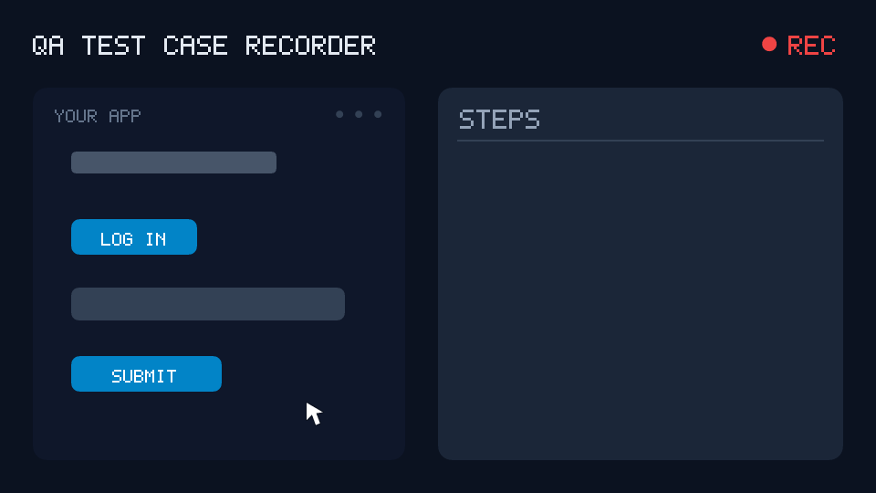

# QA Test Case Recorder

A Chrome extension for QA work: record test cases capturing **XPath and the
element's visible name**, generate **automation scripts**, and **detect bugs** as
they happen.



*An illustration of the workflow, not a screen recording — see
[Running it](#running-it) to try the real thing.*

Everything runs locally. No account, no server, no network requests: nothing you
record leaves your machine.

**License:** MIT.

## Contents

- [Running it](#running-it) · [Architecture](#architecture)
- [What gets recorded](#what-gets-recorded) — clicks, typing, keys, scrolling, iframes
- [Assertions](#assertions) — including [editing a recording afterwards](#editing-a-recording-afterwards)
- [Test data (variables)](#test-data-variables)
- [Exports](#playwright-for-python) — Playwright (TS + Python), Cypress, Selenium,
  Markdown, YAML, CSV, Excel, Zephyr Scale
- [Publishing](#publishing)

## Running it

```bash
npm run dev
```

WXT 0.21 no longer launches a browser itself, so load the extension once by hand:
`chrome://extensions` → enable Developer mode → **Load unpacked** →
`dist/chrome-mv3-dev`. After that every code change hot-reloads.

For a production build:

```bash
npm run build
```

…then load `dist/chrome-mv3` the same way. Click the toolbar icon to open the
side panel.

The output directory is `dist/`, not WXT's default `.output/` — a dot-prefixed
directory is hidden in Finder and in Chrome's folder picker, which makes
installing needlessly hard every time.

### Load the right folder — this one bites

`dist/chrome-mv3-dev` does **not** bundle the side panel's code; its
`sidepanel.html` fetches it from the dev server on localhost. With the dev server
stopped, that folder keeps serving whatever the panel last had, while
`background.js` and the content scripts — which *are* in the folder — do update.
The result is a build where some new features appear and others silently do not,
with nothing in the console to explain it.

`npx wxt build` only ever writes `dist/chrome-mv3`. Unless you are actively
running `npm run dev`, load **`dist/chrome-mv3`**.

If a feature seems missing, check `chrome://extensions` → "Loaded from" before
looking at the code.

## Architecture

| Part | Where it runs | Why there |
|---|---|---|
| `entrypoints/probe.content.ts` | content script, **MAIN world** | The only place the page's own `console` and `fetch` are visible. A normal content script lives in an isolated world and sees neither. |
| `entrypoints/recorder.content.ts` | content script, isolated world | Captures events in the capture phase and bridges probe findings to the background. Stays alive as long as the page does, unlike a service worker. |
| `entrypoints/background.ts` | service worker | The only writer to storage. Chrome tears it down after ~30s idle, so it keeps no state in memory. |
| `entrypoints/sidepanel/` | side panel | The UI. Unlike a popup, it does not close when you click the page. |
| `lib/selector-engine/` | shared | Locator generation. The heart of the project. |
| `lib/codegen/` | shared | Playwright (TS and Python) / Cypress / Selenium / Markdown / YAML / spreadsheets / Zephyr. |
| `lib/library.ts` | shared | Saved test cases. |

### Two decisions worth knowing about

**1. Generated locators do not rely on framework-invented identifiers.**
`lib/selector-engine/stable.ts` rejects ids and classes like `:r3:` (React
`useId`), `css-1a2b3c` (emotion) and CSS-modules hashes. These change on every
render or every build, so a test built on them passes once and then fails in CI
for no visible reason. A longer structural path is emitted instead.

**2. Every detected bug is linked to the step that preceded it**
(`Issue.nearStepId`). That is the difference between "there is an error in the
console" and "clicking Save is broken".

## What gets recorded

Pressing **Start recording** records the tab's current URL as the first step, so
the generated script begins by opening the page under test.

That is not incidental. Navigation steps otherwise come only from a page load that
happens *while* recording, so the normal workflow — open the page, then press
record — produced a script with no `goto` at all. It started on a blank page and
failed on its first click, with nothing in the output pointing at the cause.

The condition is **"is the flow already on this page"**, not "is this session
new" — read from the URL the last recorded step carries. Those differ in the case
that matters most: a tester stops, walks to another page, and records again,
which is the whole reason to stop. Keyed on newness, that second recording got no
`goto`, and the script's second half ran against whatever page the first half had
ended on. A navigation added mid-flow is commented `Recording resumed on this
page`, so it does not read as a mistake.

A tab that is still loading reports an empty `url` and keeps its destination in
`pendingUrl`; both are read, because pressing record while the page comes up is
ordinary and used to produce a recording that started nowhere.

The panel header names the page it is pointed at, so what will be recorded is
visible before recording starts. On a page Chrome blocks extensions from —
`chrome://`, the Web Store, a PDF viewer — it says so and disables the record
button. Recording there is impossible, and it used to fail silently.

Recordings saved before any of this existed still have no navigation step. For
those, the generated script opens with a `FIXME` naming the page it was recorded
on, rather than failing silently.


Clicks, double-clicks (a pending click is held for 220ms so a double-click can
replace it rather than producing three steps), typing, select changes,
checkbox/radio toggles, meaningful keys (Enter/Escape/Tab/arrows) and navigation.

### Keys

Keys fall into two groups, because the same key means different things in
different places. `Enter`, `Escape`, `Tab` and the up/down arrows are recorded
everywhere — tabbing out *is* the action that moves on, and up/down is how an
autocomplete list is navigated. `ArrowLeft/Right`, `Home`, `End`, `PageUp/Down`,
`Backspace` and `Delete` are recorded only **outside** a text field: inside one
they move the caret or edit characters, and the resulting text is already captured
by the fill step, so recording them would describe the same edit twice.

Modifier combinations are always recorded, as Playwright key strings
(`Control+A`, `Control+Shift+K`). The other frameworks are mapped from that:

| | Control+A |
|---|---|
| Playwright | `press("Control+A")` |
| Cypress | `type("{ctrl}a")` — lowercase on purpose; an uppercase letter in Cypress implies Shift, so `{ctrl}A` would send Ctrl+Shift+A |
| Selenium | `ActionChains(driver).key_down(Keys.CONTROL).send_keys("a").key_up(Keys.CONTROL)`, with the element clicked first to focus it |

### Typing, and masked fields

A field being typed into produces **one** step that keeps being replaced as the
value grows, rather than one step per keystroke or nothing at all until blur. The
step is debounced by 200ms and upserted, so the panel shows the value appearing
live.

The recorder also compares the characters typed against the field's final value.
When they differ, an input mask rewrote the input — a phone field turning
`9121234567` into `(912) 123-4567` — and the step is marked `typeSequentially`
with the **raw keystrokes** as its value. That matters because Playwright's
`fill()` assigns a value directly, which a masked field never sees:

```ts
await page.getByLabel('Phone').pressSequentially('9121234567');  // masked
await page.getByLabel('Email').fill('qa@test.dev');              // plain
```

Cypress and Selenium need no equivalent switch — `cy.type()` and `send_keys()` are
already keystroke-by-keystroke.

### Scrolling

Recorded as an **intent, not an offset**. A burst of scroll events is coalesced
into one step that names the element nearest the middle of the viewport when the
scrolling settled:

```ts
await page.getByTestId('load-more').scrollIntoViewIfNeeded();
```

`window.scrollTo(0, 1200)` was deliberately not used: that number means something
different on another viewport or with different content, and it is the kind of step
that passes on the machine that recorded it and nowhere else.

Two filters keep scroll steps from becoming noise, because most scrolling does
not belong in a test at all — every framework already scrolls an element into view
before acting on it:

- movement under 60px is treated as incidental
- a scroll within 700ms of a recorded action is ignored **unless a wheel or touch
  gesture came first**. The suppression is there because clicks and navigations
  scroll the page themselves; the gesture is the evidence that this one was the
  user's doing, and a page cannot fake it. Without that second half, a tester who
  clicks a filter and immediately scrolls the results loses the scroll.

#### Scrolling containers

Half the web scrolls a `div` under a fixed header rather than the document. The
scroll event for one of those does not bubble and does not move `window.scrollY`,
so a recorder that watches only the window sees the events arrive and measures no
movement — and drops every one of them, silently. Each scroll step therefore
records **what** scrolled:

```ts
await page.getByText('Nike Pegasus 41').scrollIntoViewIfNeeded();   // works either way
await page.locator('#results').evaluate((el) => { el.scrollTop = el.scrollHeight; });
```

`scrollIntoViewIfNeeded` needs no help — it scrolls whatever ancestor has to move.
The container only has to be named where the step is about the scrolling itself:
the load-more loop, and the positional fallback below.

#### When nothing can be named

On a grid of product images, a map, or a chart, the element in the middle of the
view has no accessible name and no test id — there is nothing to write a locator
for. The step is recorded anyway, as a pixel offset, and flagged:

```ts
// Nothing nameable was in view, so this is a pixel offset. Prefer scrolling to an element.
await page.evaluate(() => window.scrollTo(0, 1840));
```

That offset is a poor step for exactly the reason given above. It is still better
than the silence it replaced: the tester scrolled, the recording said nothing, and
the script went on to click something the page had not lazily rendered yet. A bad
step is visible in the panel and can be fixed; a missing one is not.

### Infinite scroll

Scrolling that *loads* content is a different action from scrolling that reveals
it, and it is told apart by one decisive signal: **the document grows**. On a
scroll that settles near the bottom, the recorder waits 900ms — long enough for
the fetch to resolve — and checks whether `scrollHeight` increased. If it did,
the step becomes `scrollToBottom` instead of an element scroll.

Consecutive rounds collapse into **one** step whose repeat count grows, using the
same upsert mechanism as live typing. Any other action ends the run, so a later
load-more is a separate step.

The generated code is a loop, and the recorded count is its **bound, not its
body**. The same list loads a different number of pages on a different day, so
what actually ends the loop is the height going stable:

```ts
let previousHeight = 0;
for (let round = 0; round < 6; round += 1) {   // recorded 4 rounds, plus headroom
  await page.evaluate(() => window.scrollTo(0, document.body.scrollHeight));
  await page.waitForTimeout(600);
  const height = await page.evaluate(() => document.body.scrollHeight);
  if (height === previousHeight) break;
  previousHeight = height;
}
```

`window.scrollTo(0, document.body.scrollHeight)` is used rather than a wheel
gesture or an `End` keypress: it needs neither the pointer to be over the list nor
the body to hold focus. And unlike the fixed offset rejected above, "the bottom" is
a position with a meaning rather than a number that happened to be true once.

A list that scrolls inside a container gets the same loop against that element
rather than the window.

Cypress is the exception — its command queue is not imperative, so a
stop-when-it-stops-growing loop is not expressible. It repeats the recorded count
with `cy.scrollTo('bottom')`, which is exactly what the tester did.

Selenium's loop needs `time.sleep`, so `import time` appears only in files that
contain one.

**Password fields are never captured.** The step is flagged `sensitive` and the
generated script reads `TEST_PASSWORD` from the environment — so a recorded login
flow can be committed to a repository without leaking a credential.

## Test data (variables)

A login scenario needs a phone number and a password, and a team reuses one fixed
pair across every scenario. Baking those into each recording means the literal
ends up in every generated script and every exported sheet, and changing the test
account means editing all of them.

**Tools → Test data** defines them once: a name in environment-variable form
(`TEST_PHONE`), a value, and a `secret` flag. While recording, a field filled with
a value matching one of these stores the **variable's name instead of the
literal** — so nothing downstream ever sees it:

| Output | What appears |
|---|---|
| Playwright | `fill(process.env.TEST_PHONE ?? "")` |
| Cypress | `type(Cypress.env("TEST_PHONE"))` |
| Selenium | `send_keys(os.environ["TEST_PHONE"])` |
| Markdown / CSV / Excel | `${TEST_PHONE}` |
| YAML | `variable: TEST_PHONE`, with no `value` key |

Generated scripts open with the list of variables they need, and the Script tab
shows the same list above the code, so nobody discovers a missing value one failed
run at a time.

### BASE_URL

Define a variable named `BASE_URL` under Test data and every recorded navigation
that sits under it is generated relative to it, so one test runs against staging
and production instead of being copied per environment:

```js
await page.goto(process.env.BASE_URL + "/login");   // recorded on https://app.test/login
await page.goto("https://payments.other.test/checkout"); // different host — left absolute
```

Cypress gets `Cypress.env("BASE_URL")` and Selenium `os.environ["BASE_URL"]`, so
all three read the same file the **Download .env** button writes. Playwright's own
`baseURL` config option would be more idiomatic, but it needs an edit to
`playwright.config.ts` that the generated file cannot make — concatenation works
with nothing but the variable set.

This is resolved at generation time, not at recording time: the recorded URL is a
fact, the base is a presentation choice. So defining `BASE_URL` after recording
still works, and the same recording can produce either form.

Prefix matching is on path boundaries — a base of `https://app.test` does not
swallow `https://app.testing.com`.

### Running the script: two different places

The value in the Test data panel is used at **record** time, so the recorder can
substitute a name for a literal. It is **not** what the script reads when it runs
— if it were, the credential would end up in the repository, which is the thing
this feature exists to prevent.

At run time the script reads the environment: `process.env.NAME` for Playwright,
`Cypress.env("NAME")` for Cypress, `os.environ["NAME"]` for Selenium.

**Download .env** in the Script tab writes that file, with the variable names
already correct — `cypress.env.json` when the selected format is Cypress, `.env`
otherwise. Non-secret values are filled in; **secret values are left blank** with
a comment naming them. Writing a password into a downloaded file is how it ends up
in a commit, and a blank line is a better prompt than a filled one.

Both files must be gitignored. `cypress.env.json` especially — it sits at the
project root and looks like ordinary config.

### The password case

A password field is the one place the recorder reads a password at all. The
contents are compared against the known secrets **in memory**, and what gets
stored is a variable name — never the text. A password that matches nothing is
recorded as `sensitive` with no value, exactly as before, and generated code falls
back to `TEST_PASSWORD`.

Matching is exact and longest-value-first, so a variable whose value is a prefix
of another's does not shadow the more specific one.

### Two things to be clear about

Variable values live unencrypted in `chrome.storage.local`, like a `.env` file on
disk. That is appropriate for a shared test account and for nothing else.

Secret values are **never written into an export or a library file** — only names
travel. So `qa-library.json` stays safe to commit, and a teammate who imports it
supplies their own values.

## Assertions

Mid-recording, **right-click** any element → "QA — add assertion":

| Menu entry | Playwright output |
|---|---|
| Assert this text appears on the page | `expect(page.getByText("…").first()).toBeVisible()` |
| Assert this element's text | `expect(loc).toHaveText(...)`, or `toContainText` past 60 characters |
| Assert this field's value | `expect(loc).toHaveValue(...)` |
| Assert this element is visible | `expect(loc).toBeVisible()` |
| Assert this element is hidden | `expect(loc).toBeHidden()` |
| Assert the page URL | `expect(page).toHaveURL(...)` |

Each assertion is an ordinary step: deletable, annotatable, and placed in the
script exactly where it was recorded. The panel marks them green with a ✓.

### Editing a recording afterwards

A recording is a first draft, and the assertion a tester wants is almost never the
one they thought of mid-click — it arrives afterwards, reading the steps back. The
✎ on each step opens an editor for that:

- **Add an assertion after this step.** The two page-level checks (text on the
  page, page URL) are always offered. On a step that has an element, the four
  element checks are offered too and **reuse that step's locator and iframe** —
  which is why the form lives per-step rather than in one global panel: there is
  no element picker, and it needs none. `+ Add an assertion at the end` does the
  same at the bottom of the list.
- **Edit the value** — the text typed into a field, the expected string in an
  assertion, a URL.
- **Reorder** with ↑ / ↓, and delete with ✕. Steps are renumbered by position, so
  the list always reads 1..n.

What is *not* editable is deliberate. Locators, iframe paths and timestamps are
the record of what actually happened; rewriting them from the panel would turn
"edit this test case" into "fabricate a recording". Nor can a value be typed over
a password step or a variable step — the first never had its text captured, and
the second is changed under Test data. That rule is enforced in the store, not
just hidden in the UI.

Long text switches to `contains` automatically because equality on a long
sentence breaks on any incidental whitespace or copy edit, and that failure
points at no real bug.

For text assertions the element is exactly what was right-clicked. For visibility
and value assertions it resolves up to the nearest interactive ancestor — when
you right-click the label inside a button, you meant the button.

### Element text vs. text on the page

These two look similar and fail differently, which is the whole reason both exist.

`Assert this element's text` binds to a locator: `//h2[@id="status"]` must hold
"Order confirmed". Move that message from an `<h2>` to a `<div>` and the test
fails while nothing is actually broken.

`Assert this text appears on the page` binds to the text and says nothing about
the markup — `getByText`, `cy.contains`, or an XPath over text nodes. Use it for
success messages, error banners and toasts, which is exactly the content that
gets re-homed in the DOM. Use the element-bound one when *where* the text appears
is part of what you are testing.

If you select a phrase before right-clicking, that selection is what gets
asserted; otherwise the element's own text is used, capped at 120 characters —
substring matching makes a long phrase more brittle, not less, since any copy edit
inside it breaks the assertion.

Three details in the generated code that are not cosmetic:

- Playwright gets `.first()`. `getByText` can match several nodes, and strict mode
  turns that into a "strict mode violation" instead of a useful failure.
- Selenium gets `//*[text()[contains(normalize-space(.), …)]]`, not
  `//*[contains(., …)]` — the latter also matches `<html>` and `<body>`, which
  contain every string on the page and therefore always pass.
- The expected text lands inside an XPath literal inside a Python literal, so it
  is quoted for XPath first. Text holding both quote characters cannot be a single
  XPath 1.0 literal at all, so that case emits a FIXME rather than broken XPath.

## Playwright for Python

`Playwright (Python)` emits the shape `playwright codegen --target python` does:
the synchronous API driven from a `run(playwright)` function, launched at the
bottom by a `with sync_playwright()` block, with the `# ---------------------`
marker before teardown.

```python
from playwright.sync_api import Playwright, sync_playwright, expect


def run(playwright: Playwright) -> None:
    browser = playwright.chromium.launch(headless=False)
    context = browser.new_context()
    page = context.new_page()
    page.goto("https://www.digikala.com/")
    page.get_by_role("button", name="ورود | ثبت‌نام").click()
    page.get_by_test_id("add-to-cart").click()
    expect(page.get_by_text("سبد خرید").first).to_be_visible()

    # ---------------------
    context.close()
    browser.close()


with sync_playwright() as playwright:
    run(playwright)
```

Not a pytest module, deliberately: this is the form a tester runs with
`python flow.py` to watch the browser do it, which is what a freshly recorded flow
is for.

Four differences from the TypeScript output that are not stylistic:

- Methods are snake_case and the accessible name is a keyword argument:
  `get_by_role("button", name="…")`.
- `.first` is a **property** in Python, not the method it is in JavaScript, so the
  text-presence assertion ends `.get_by_text(…).first)` with no call parentheses.
- `import os` and `expect` are emitted only when the body uses them. Playwright's
  own codegen emits both unconditionally along with an unused `import re`, which
  is a lint failure under ruff's F401 in most projects.
- Exporting several test cases produces one `run_<name>` function each, called in
  order from the same `with` block. A title that cannot become an ASCII identifier
  — Persian, for instance — becomes `run_case_1` with the real title kept as the
  function's docstring.

`exact=True` is not emitted. Playwright's codegen adds it when it needs to
disambiguate between two matching names on the live page; that is a judgement this
generator cannot make after the fact, so widen or tighten the locator by hand if a
name turns out to be ambiguous.

## Test-case library

The **Library** tab stores the current recording via "Save current recording".
Saved cases live in `chrome.storage` (capped at 100) as full snapshots, so each
one can be exported to any format later — not only the format selected when it
was saved.

### Backup and team sharing

`chrome.storage.local` is per-Chrome-profile and local. Every teammate has their
own isolated library, and uninstalling the extension erases it — so the library
alone is not somewhere test cases can safely live.

**Export library file** writes the whole library as one pretty-printed
`qa-library.json`, meant to be committed to the repo or dropped in a shared
folder. **Import library file** reads it back. That is the only format that
round-trips: a "Raw session (JSON)" export is a different shape and is rejected
with a message saying so.

Import **merges and never overwrites**. An incoming test case either matches
something already present or becomes a new entry:

| Situation | Result |
|---|---|
| Identical content already present | skipped — re-importing a file is a no-op |
| Same id, content diverged | kept as a separate entry, titled "… (imported)" |
| New | added, keeping its id so a later re-import stays idempotent |
| Would exceed 500 cases | skipped **and reported** |

Matching is by content fingerprint (title plus each step's action, XPath and
value), not by id — two people recording the same flow produce different ids, so
id-only matching would import the same case twice.

Overwriting was deliberately left out: a teammate's file would then silently
replace work that is not in it.

`chrome.storage.sync` was considered and rejected — its quota is 102 KB total and
8 KB per item, and a 30-step test case is about 19 KB.

The cap is **500 test cases**, and the panel shows the live count and the actual
bytes in use (`chrome.storage.local.getBytesInUse`) next to the download buttons.
Measured at that cap: ~3.3 MB for 500 short cases, ~9 MB at 30 steps each, ~18 MB
at 60. The last figure is past the 10 MB default quota, so the manifest asks for
`unlimitedStorage` — it adds no install-time warning, and without it a team with
substantial test cases would hit a write failure somewhere north of 300 saves.

The cap used to truncate with `slice(0, MAX)`, which dropped the **oldest** saved
case without a word. It now refuses the save with a message naming the limit, and
a quota failure is translated into "export the library, then clear some cases"
rather than a raw `QUOTA_BYTES quota exceeded`.

### Zephyr Scale export (Jira)

`Zephyr Scale (CSV)` and `Zephyr Scale (Excel)` write the shape Zephyr's test-case
importer expects: `Name`, `Objective`, `Precondition`, then one row per step with
`Test Script (Step-by-Step) - Step / Test Data / Expected Result`. Case-level
fields appear on the first row of each test case and are left blank on the
continuation rows, which is how Zephyr Scale groups rows into one case.

The column names are the easy half. The real work is that **Zephyr and a recorder
disagree about what a step is**. Zephyr models one step as a triple — do this,
with this data, expect that. A recording has the assertion as its *own* step,
sitting after the action it checks. So `foldSteps` in `lib/export/zephyr.ts`
merges each run of assertions into the preceding action's Expected Result:

| Recorded | Exported |
|---|---|
| `4 Click "Log in"` | Step: `Click "Log in" button` |
| `5 Assert URL …/home` | → folded into step 4's Expected Result |
| `6 Assert text "Dashboard"` | → folded into step 4's Expected Result, second line |

An assertion with no action before it becomes a `Verify: …` step of its own rather
than being dropped. The opening navigation becomes the Precondition, not a step.

Test data appears as `${TEST_PHONE}`, never the literal — a Jira ticket is visible
to far more people than a test repository.

**Locators are deliberately omitted.** Zephyr has no field for an XPath, and a
test case a person reads should not carry one. This export is the human test case;
Playwright/CSV/YAML remain the automation artefact.

Verified with Python's `csv` module and openpyxl: 20 assertions covering the
column layout, the fold, blank continuation rows, the leading-assertion case, and
that no literal credential or locator reaches the file.

Built for **Zephyr Scale** (formerly TM4J), whose importer takes CSV/Excel.
Zephyr Squad loads steps through its own API rather than a file, so the same
transformation would need a different carrier there.

### YAML export

**Test cases (YAML)** writes a readable, diff-friendly document — the reason to
pick YAML over JSON. One `testCases` list, each with `steps`, each step carrying
its `element` (name, type, testId, xpath, css), its `frame` chain when it happened
inside an iframe, and `value` for an action or `expected` for an assertion. A
secret step is marked `secret: true` with no value.

It is an **export only**. The importable round-trip format is still the library
JSON: reading YAML back would mean writing a parser as well, and MV3 rules out
pulling one in.

`lib/export/yaml.ts` emits it directly, and the scalar quoting there is the whole
job. The values are hostile to naive serialisation:

- XPath expressions are full of `"`, `[`, `@` and `:`
- a typed card number must stay `"4242424242424242"`, not become a float; `1.10`
  must not become `1.1`; `007` must keep its zeros
- `no`, `yes`, `on`, `off`, `~`, `null` are booleans and null under YAML 1.1 — an
  element literally labelled "No" would otherwise round-trip as `false`

Anything not provably safe as a plain scalar falls back to `JSON.stringify`, which
is a valid YAML double-quoted scalar (the escape sets are identical) — so the hard
cases are handled by a function that is already correct rather than by more rules.

Verified by parsing the output back with PyYAML and comparing every value against
what went in: 20 assertions over 30 deliberately hostile strings.

### Spreadsheet export

**CSV** and **Excel (.xlsx)** sit alongside the code formats, for teams who keep
test cases in a sheet or import them into TestRail / Zephyr / Xray.

Columns: Test Case, Step, Action, Element, Element Type, Frame, XPath, CSS
Selector, Test ID, Value, Note, URL. The workbook has a second **Issues** sheet —
one row per detected bug, with the step it followed. Both sheets get a frozen
header row and an autofilter, because this file exists to be sorted and filtered.

No spreadsheet library is bundled. An .xlsx is a ZIP of XML parts, and MV3
forbids remote code, so `lib/export/zip.ts` writes the archive directly (stored
entries, ~120 lines) instead of shipping hundreds of kilobytes of dependency for
a few KB of output.

Two details that are easy to get wrong and were verified rather than assumed:

- The CSV carries a **UTF-8 BOM**. Excel sniffs encoding, and without it reads
  UTF-8 as the local codepage — turning every Persian element name into mojibake.
- Step numbers and issue counts are written as **numbers**, not text, so sorting
  a column does not order 10 before 2.

Verified by reading the generated workbook back with openpyxl: 19 assertions on
the xlsx (sheet names, frozen panes, autofilter, numeric cells, Persian text,
embedded newlines/quotes/commas, password redaction) and 7 on the CSV.

**"Download all as one file"** produces a single runnable file rather than a
folder of separate downloads:

- Playwright → several `test()` blocks in one spec
- Cypress → several `it()` blocks in one `describe`
- Selenium → several `def test_*` in one module
- Markdown → one document, one section per case
- CSV / Excel → every case in one sheet, distinguished by the Test Case column

A Persian test-case title becomes `def test_case_N` in Selenium (a Python
identifier only accepts ASCII here) with the original title preserved as a
docstring.

## What gets detected

The page's `console.error` / `console.warn`, uncaught errors, unhandled promise
rejections, `fetch` and `XMLHttpRequest` failures, 4xx/5xx responses, and
resources that failed to load.

Collection is **always on**, not only while recording — nobody presses record
before seeing a bug. A cap of 40 reports per 5 seconds stops a render loop from
flooding the panel.

Detected bugs are never turned into assertions, only into trailing comments:
asserting a bug passes would freeze it in place.

## Fonts

The UI is English and renders in the system face. But recorded data is not UI
text: capturing a flow on a Persian site fills the step list with Persian element
names, so **Vazirmatn** (SIL OFL 1.1) is bundled to render those.

The `unicode-range` on that `@font-face` is load-bearing, not an optimisation.
Vazirmatn has to sit *before* the system face in the stack, because per-glyph
fallback only advances when the current family lacks the glyph — and macOS
system-ui does cover Arabic, so a Vazirmatn placed later is never reached.
Declaring the range instead gives all three properties at once:

- Latin codepoints fall straight through to the system face
- Persian codepoints resolve to Vazirmatn
- the 111KB file is not requested at all until Persian text is rendered

Verified by measurement: a space-free Persian string renders at exactly the
Vazirmatn width and not the system-ui width, while Latin renders at exactly the
system-ui width. Spaces come from the system face (U+0020 is deliberately outside
the range, so Vazirmatn never claims spaces in English text) — the same trade-off
every Google Fonts subset makes.

Elements holding page-derived text use `dir="auto"`, so an RTL element name
renders correctly inside the LTR panel.

IRANSans was considered and dropped. It is neither a system font nor on any
public CDN, so it renders nothing without shipping the file — and it is
proprietary (free for personal use, commercial use requires a FontIran licence),
which makes bundling it into a distributed extension a licensing question.

## iframes

Both content scripts run in **every** frame, so a click inside a payment, SSO or
3DS iframe is recorded instead of silently dropped.

The hard part is not capturing the event — it is naming the frame in a way that
survives into a generated test. A Chrome frame id means nothing at replay time,
so what a step stores is a **locator for the `<iframe>` element itself**, as seen
from its parent document (`RecordedStep.framePath`).

A cross-origin frame cannot read its parent's DOM, so it asks instead
(`lib/frame-path.ts`): it posts "which iframe am I?" upwards, and the parent —
which owns that element and has its own content script — answers with its own
path plus a locator for the child. The recursion ends at the top frame, whose
path is empty. Replies are accepted only from `window.parent`, so another frame
on the page cannot forge a path.

The iframe locators go through the same selector engine as everything else, so a
frame with `data-testid` is targeted by it rather than by position.

### What each framework can express

| | Support |
|---|---|
| Playwright | Full, any depth — `page.frameLocator(a).frameLocator(b).getBy…` |
| Selenium | Full, any depth. The driver has one current frame, so the generator descends from `default_content()` and only re-switches when the frame actually changes |
| Cypress | One level, via the cypress-iframe plugin. Deeper chains are emitted **commented out** with the frame chain in a FIXME |
| Markdown | A Frame column showing the chain |

Two cases deliberately produce commented-out code rather than something that
looks right and fails: a nested chain in Cypress, and a frame whose identity
never resolved (`FrameRef.unresolved`). An empty `frameLocator('')` or
`By.XPATH, ""` does not merely miss the element — it throws and takes the rest of
the test with it. The action is emitted as a comment, minus its unusable frame
wrapper, so the file still runs and the gap is visible.

URL assertions are refused inside an iframe: they would assert the frame's own
URL, which no framework expresses cleanly. The recorder says so on screen rather
than recording something misleading.

An iframe with no `src` and no `name` — TinyMCE and other embedded editors build
theirs in JavaScript — is handled the same way as any other: the chain stores a
locator for the element, which for `<iframe id="mce_0_ifr">` is `#mce_0_ifr`.
Verified against https://the-internet.herokuapp.com/iframe.

A click on empty page background resolves to `<html>`, whose locator `/html` is
valid XPath and a useless test step. It is normalised to `body` instead of being
dropped, because clicking the background to dismiss a menu is a real test action.
The root and body also report no accessible name: their `innerText` is the whole
document, which as a step label reads like a real element name and is worse than
an empty one.

## Known limits of this phase

- No screenshots or annotation.
- Assertions can only be added from the context menu; their expected value
  cannot be edited in the panel afterwards.
- No API mocking.
- Cannot be injected into `chrome://` pages, the Chrome Web Store, or the PDF
  viewer — a Chrome restriction, not something the extension can work around.

## Publishing

`STORE-LISTING.md` holds the Chrome Web Store submission copy: the single-purpose
statement, descriptions, and a justification for every permission — the part that
decides whether a submission with `<all_urls>` gets held up. `PRIVACY.md` is the
privacy policy the store requires once any data category is declared; it needs a
contact address filled in and a public URL to live at.

Upload `dist/qa-test-case-recorder-<version>-chrome.zip` from `npm run zip`. That
archive has `manifest.json` at its root, which the store requires — an archive
with the files inside a folder is rejected.

The icon is generated by `tools/make-icons.mjs`, not drawn by hand, so it stays
reproducible:

```bash
node tools/make-icons.mjs public/icon
```

It renders with 4×4 supersampling, and composes differently per size: the full
cursor plus the record dot at 32 px and up, and at 16 px a reshaped cursor with a
wider tail, because the standard tail is one pixel wide there and disappears.

## Commands

```bash
npm run dev       # dev build + hot reload
npm run build     # production build in dist/chrome-mv3
npm run zip       # Web Store upload package
npm run compile   # typecheck only
```
